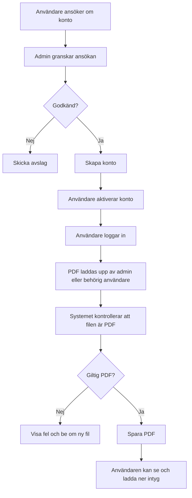

# Enkelt flöde: från ansökan till PDF

```mermaid
flowchart TD
    A[Användare ansöker om konto] --> B[Admin granskar ansökan]
    B --> C{Godkänd?}
    C -->|Nej| D[Skicka avslag]
    C -->|Ja| E[Skapa konto]
    E --> F[Användare aktiverar konto]
    F --> G[Användare loggar in]
    G --> H[PDF laddas upp av admin eller behörig användare]
    H --> I[Systemet kontrollerar att filen är PDF]
    I --> J{Giltig PDF?}
    J -->|Nej| K[Visa fel och be om ny fil]
    J -->|Ja| L[Spara PDF]
    L --> M[Användaren kan se och ladda ner intyg]
```

<!-- Copyright (c) Liam Suorsa and Mika Suorsa -->
