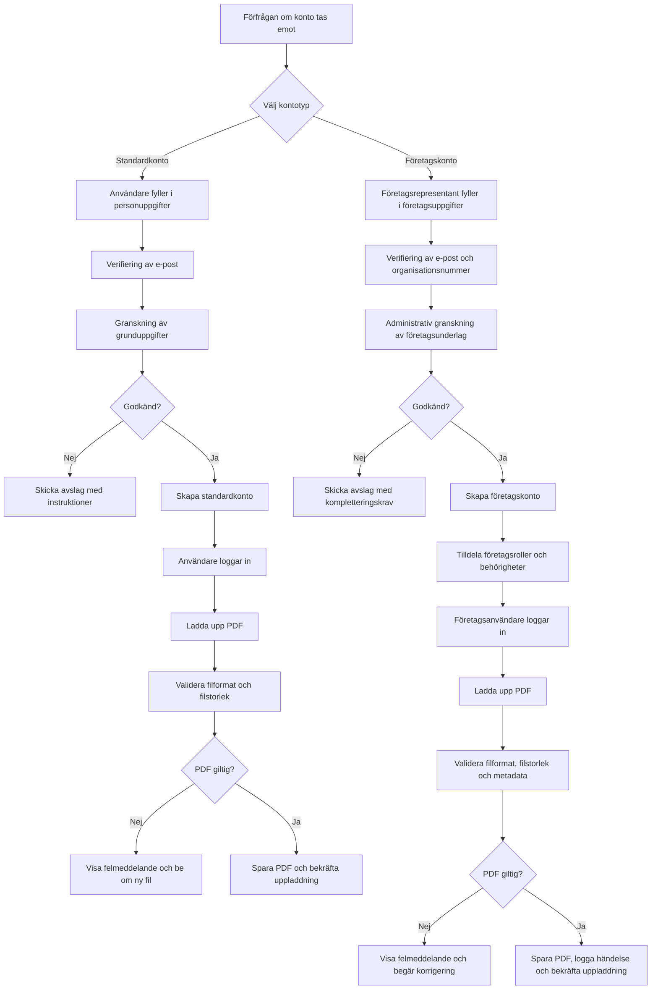

# Flödesschema: Från kontoansökan till uppladdning av PDF

Nedan visas ett flöde för både **standardkonto** och **företagskonto**, från första förfrågan om konto till att en PDF laddas upp.

<!-- Copyright (c) Liam Suorsa -->
