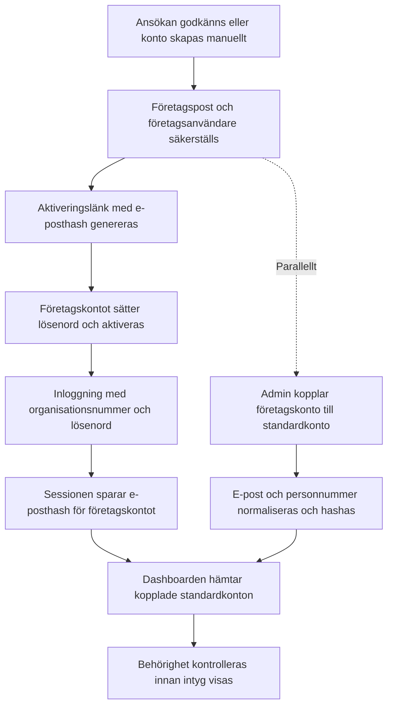

# JK Utbildningsintyg
[](https://github.com/PyCQA/bandit)
[](https://app.codacy.com/gh/Mr-cool08/JK-utbildnings-intyg/dashboard?utm_source=gh&utm_medium=referral&utm_content=&utm_campaign=Badge_grade)

This web application manages the issuance and storage of course certificates. It separates responsibilities between administrators and end users so each party can focus on their own tasks.

## Getting started

1. **Install dependencies**
   ```bash
   python -m venv venv
   source venv/bin/activate
   pip install -r requirements.txt
   ```
2. **Configure environment variables** – copy `.example.env` to `.env` and update the values to match your setup. Provide the credentials for your external PostgreSQL server by setting `POSTGRES_HOST`, `POSTGRES_DB`, `POSTGRES_USER`, `POSTGRES_PASSWORD`, and optionally `POSTGRES_PORT`. The container derives the SQLAlchemy connection string from these values whenever `DATABASE_URL` is empty. If you prefer, you can instead set `DATABASE_URL` directly to a PostgreSQL connection string. For local development or automated tests you may temporarily enable `ENABLE_LOCAL_TEST_DB` to let the app create a SQLite database file defined by `LOCAL_TEST_DB_PATH`; the flag is disabled by default so production deployments still require PostgreSQL. När applikationen körs bakom en omvänd proxy kan du ställa in `TRUSTED_PROXY_COUNT` för att ange hur många hopp som ska litas på.

3. **Run the application**
   ```bash
   python app.py
   ```
   The app will be available on <http://localhost:80>. For container-based deployment see [DEPLOYMENT.md](DEPLOYMENT.md).

### Anpassa TLS-certifikat

Om du vill köra Flask-appen med TLS lokalt anger du PEM-innehållet via
``TLS_CERT`` och ``TLS_KEY`` i
din `.env`-fil eller pekar på filer med ``TLS_CERT_PATH`` och
``TLS_KEY_PATH``. När båda värdena finns skrivs innehållet till
`/config/certs/server.crt` och `/config/certs/server.key` i containern.

### Driftsättning med Cloudflare Origin CA

1. Skapa ett Origin CA-certifikat i Cloudflare för `utbildningsintyg.se` och
   `demo.utbildningsintyg.se`. Kopiera certifikat och privat nyckel till två
   separata filer i PEM-format.
2. Lägg filerna i `deploy/certs/` som `server.crt` och `server.key` och se till
   att de inte checkas in i Git.
3. Sätt Cloudflare-zonens SSL/TLS-läge till **Full (strict)** efter att
   certifikatet har installerats.

Observera att Cloudflare Origin CA-certifikat endast fungerar när trafiken går
via Cloudflare. För utveckling kan du istället lägga PEM-innehållet i
``TLS_CERT`` och ``TLS_KEY`` i `.env` (eller använda ``TLS_CERT_PATH`` och
``TLS_KEY_PATH``) så att applikationen startar med TLS även lokalt.


## How it works for administrators

* **Login** – Administrators sign in with credentials configured by the owner. A valid session grants access to the admin panel.
* **Register pending users** – Through the admin panel an administrator submits a learner’s email, username and Swedish personal number together with a PDF certificate. The system normalises the personal number and stores the certificate in a folder named after that number.
* **Database entry** – If the learner is not yet active, an entry is created in the `pending_users` table pointing to the uploaded PDF. Should the learner already exist, only the PDF is added to their folder.
* **Security checks** – Uploaded files are verified to be genuine PDFs before storage. Each file receives a timestamped name to avoid collisions.

## How it works for users

* **Account activation** – After an administrator registers them, the learner visits a personalised account creation link and sets a password. The pending entry is moved into the `users` table.
* **Login and dashboard** – Users sign in with their personal number and password. A successful login opens a dashboard listing all PDF certificates stored for that personal number.
* **Downloading certificates** – Each listed PDF links to a direct download route so the learner can retrieve their documents whenever needed.
* **Session management** – Logging out clears the session for both user and admin roles, ensuring access is protected.

## Data storage

* **File system** – Certificates reside in an `uploads/<personnummer>/` directory structure. The application only accepts PDF files to prevent accidental uploads of other formats.
* **Hashed credentials** – Passwords are hashed with a per-user salt using PBKDF2 via Werkzeug, while personal numbers and emails are deterministically hashed with a global salt so sensitive data isn't stored in plain text.

## Persistent data with Docker

Running the application with Docker Compose stores mutable data in named volumes so that updates to the container image do not remove important files:

* `env_data` – contains the `.env` configuration file mounted at `/config/.env` inside the container.
* `uploads_data` – keeps user uploads available at `/app/uploads`.
* `logs_data` – retains application logs under `/app/logs/`.
These volumes have fixed names so existing data is reused across container rebuilds.

Ensure the `env_data` volume includes a valid `.env` file before starting the container to provide required configuration values for the external PostgreSQL server.

### Anpassa publikt nätverk

Om din infrastruktur redan har ett Docker-nätverk som ska delas med proxyn kan
du sätta miljövariabeln `PUBLIC_NETWORK_NAME` innan du kör `docker compose`
så att stacken återanvänder det angivna nätverket och ger proxyn en adress därifrån.

## Backup av PostgreSQL (produktion)

Produktionstacken innehåller en backup-tjänst som kör `pg_dump` och sparar
komprimerade `.sql.gz`-filer i volymen `pgdata_backups` (standard 7 dagars
retention).

### Kör backup manuellt

```bash
docker compose -f docker-compose.prod.yml exec postgres_backup \
  /scripts/postgres_backup.sh --once
```

### Återställ senaste backup

```bash
LATEST_BACKUP=$(docker compose -f docker-compose.prod.yml exec -T postgres_backup \
  /bin/sh -c 'ls -t /backups/backup-*.sql.gz | head -n 1')

docker compose -f docker-compose.prod.yml exec -T postgres_backup \
  /bin/sh -c "gunzip -c ${LATEST_BACKUP} | psql -h postgres -U ${POSTGRES_USER} -d ${POSTGRES_DB}"
```

## Flöde för företagskonton och kopplingar

Diagrammet nedan visar hur ett företagskonto skapas, aktiveras och kopplas till standardkonton samt hur kopplade konton laddas efter inloggning.



## Running tests

```bash
pytest
```

## Testa ansökningsflödet lokalt

1. Starta applikationen med `python app.py` och öppna <http://localhost/ansok>.
2. Skicka in formuläret med namn, e-post och organisationsnummer för att skapa en väntande ansökan. Företagskontot behöver dessutom fylla i företagsnamn samt fakturaadress, kontaktperson och märkning så att fakturering kan ske korrekt; standardkonton kan lämna dessa fält tomma.
3. Logga in som administratör och öppna <http://localhost/admin/ansokningar> för att granska, godkänna eller avslå ansökan. Alla ändringar uppdateras direkt och skickar svenska e-postmeddelanden vid godkännande eller avslag. Efter godkännande visas företaget automatiskt på faktureringssidan <http://localhost/admin/fakturering> tillsammans med de insamlade faktureringsuppgifterna.
