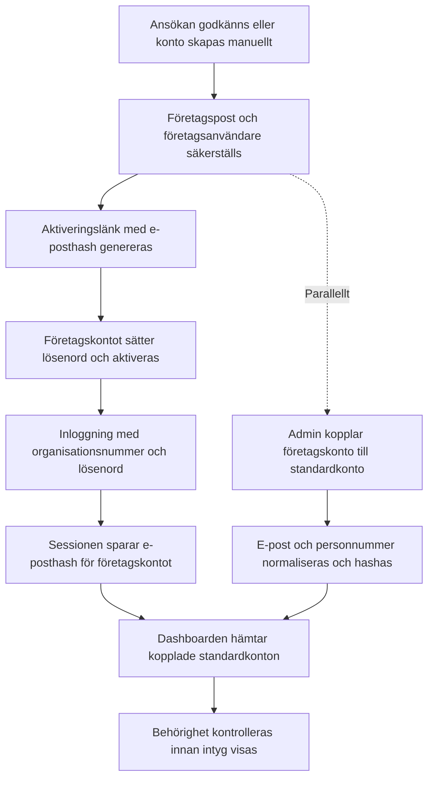

<!-- # Copyright (c) Liam Suorsa -->
# JK Utbildningsintyg
[](https://github.com/PyCQA/bandit)
[](https://app.codacy.com/gh/Mr-cool08/JK-utbildnings-intyg/dashboard?utm_source=gh&utm_medium=referral&utm_content=&utm_campaign=Badge_grade)
[](https://app.codacy.com/gh/Mr-cool08/JK-utbildnings-intyg/dashboard?utm_source=gh&utm_medium=referral&utm_content=&utm_campaign=Badge_coverage)

Den här applikationen hanterar uppladdning och nedladdning av utbildningsintyg i PDF-format för svenska användare. Administratörer kan registrera intyg för användare baserat på deras personnummer, och användare kan logga in för att ladda ner sina intyg.

## Snabbstart

### Lokal utveckling

1. **Installera beroenden**
   ```bash
   python -m venv venv
   source venv/bin/activate
   pip install -r requirements.txt
   ```
   På Windows kan du istället köra `pip install -r requirements.windows.txt` för att använda binära hjul utan `pg_config`.
2. **Konfigurera miljövariabler** – kopiera `.example.env` till `.env` och fyll i värdena. Ange din externa PostgreSQL-server via `POSTGRES_HOST`, `POSTGRES_DB`, `POSTGRES_USER`, `POSTGRES_PASSWORD` (samt valfritt `POSTGRES_PORT`). Om `DATABASE_URL` är tom byggs anslutningssträngen automatiskt från dessa värden; du kan även sätta `DATABASE_URL` direkt. För lokal utveckling kan du använda `DEV_MODE` för att aktivera Flask-debuggning, lokal SQLite samt mer omfattande debug-loggar utan att behöva duplicera inställningar. Demoläge styrs via `ENABLE_DEMO_MODE`. När applikationen körs bakom omvänd proxy styr `TRUSTED_PROXY_COUNT` hur många hopp som ska litas på.

3. **Kör applikationen**
   ```bash
   python app.py
   ```
   Appen svarar på <http://localhost:80>.

#### Utvecklingsläge utan Docker

För att köra i utvecklingsläge utan Docker kan du använda den lokala `.env`-filen och slå på `DEV_MODE`. Det aktiverar Flask-debuggning, lokal SQLite och mer detaljerad loggning utan extra konfiguration. Demoläge styrs separat via `ENABLE_DEMO_MODE`.

1. **Skapa lokal konfiguration**
   ```bash
   cp .example.env .env
   ```
2. **Aktivera utvecklingsläge** – sätt följande i `.env`:
   ```env
   DEV_MODE=True
   PORT=8080
   ```
   `DEV_MODE` tvingar fram lokal SQLite, så du behöver inte konfigurera PostgreSQL för att komma igång.
3. **Starta applikationen**
   ```bash
   python app.py
   ```
   Appen svarar på <http://localhost:8080>.

### Docker och produktion

- **Utveckling med Docker Compose**
  ```bash
  docker compose up --build
  ```
  Demoläget kan startas separat med `docker compose up --build app_demo`.

- **Produktion** – se den fullständiga guiden i [docs/DEPLOYMENT.md](docs/DEPLOYMENT.md) för GHCR/Docker Hub, volymer och Portainer.

### Antivirus-skanner som container

En ClamAV-baserad skanner kan köras som en separat container för att regelbundet genomsöka filer och loggar utan att påverka huvudapplikationen. Tjänsten ligger under profilen `security` och startas vid behov:

```bash
docker compose --profile security up --build antivirus
```

I produktion finns samma tjänst i `docker-compose.prod.yml`; aktivera med `--profile security` när skannern ska användas. Standardinställningen skannar hela serverns filsystem via en read-only mount av `/` var sjätte timme och skriver resultat i volymen `antivirus_logs`. Filborttagning sker aldrig automatiskt, men om du anger `ANTIVIRUS_QUARANTINE_PATH` flyttas infekterade filer till den volymmonterade karantänmappen.

Miljövariabler för finjustering:

* `ANTIVIRUS_SCAN_PATHS` – mellanslagsseparerade sökvägar att skanna (standard `/host` för att omfatta hela värdmaskinen; justera för att begränsa skanningen vid behov).
* `ANTIVIRUS_SCAN_SCHEDULE` – cron-uttryck för skanningsintervallet (standard `0 */6 * * *`).
* `ANTIVIRUS_QUARANTINE_PATH` – destination för karantän om filer ska flyttas i stället för att bara rapporteras.
* `ANTIVIRUS_EXTRA_ARGS` – valfria ytterligare flaggor till `clamscan`.
* `CRITICAL_ALERTS_EMAIL` – mottagare av varningsmejl när infekterade filer hittas.
* `smtp_server` – SMTP-server för utskick.
* `smtp_port` – SMTP-port (standard `587`).
* `smtp_user` – SMTP-användarnamn för inloggning och avsändaradress.
* `smtp_password` – SMTP-lösenord.
* `smtp_from` – valfri avsändaradress om `smtp_user` inte är en fullständig e-postadress.
* `smtp_timeout` – timeout i sekunder för SMTP-anslutningen (standard `10`).

## Dokumentation och struktur

- All samlad dokumentation finns i [docs/INDEX.md](docs/INDEX.md).
- Översiktlig struktur finns i [docs/REPO_STRUCTURE.md](docs/REPO_STRUCTURE.md).
- Drift- och säkerhetsdokumentation finns i [docs/](docs/) och [docs/SECURITY.md](docs/SECURITY.md).
- Hjälpskript ligger i `scripts/`; exempelvis SMTP-testet `scripts/send_test_email.py`.

### Anpassa TLS-certifikat

Om du vill köra Flask-appen med TLS lokalt anger du PEM-innehållet via
``TLS_CERT`` och ``TLS_KEY`` i
din `.env`-fil eller pekar på filer med ``ORIGIN_CERT_PATH`` och
``ORIGIN_KEY_PATH``. När båda värdena finns skrivs innehållet till
`/etc/ssl/cloudflare/origin.crt` och `/etc/ssl/cloudflare/origin.key` i containern.

### Driftsättning med Cloudflare Origin CA

1. Skapa ett Origin CA-certifikat i Cloudflare för `utbildningsintyg.se` och
   `demo.utbildningsintyg.se`. Kopiera certifikat och privat nyckel till två
   separata filer i PEM-format.
2. Lägg filerna i `deploy/certs/` som `server.crt` och `server.key` och se till
   att de inte checkas in i Git.
3. Sätt Cloudflare-zonens SSL/TLS-läge till **Full (strict)** efter att
   certifikatet har installerats.

Observera att Cloudflare Origin CA-certifikat endast fungerar när trafiken går
via Cloudflare. För utveckling kan du istället lägga PEM-innehållet i
``TLS_CERT`` och ``TLS_KEY`` i `.env` (eller använda ``ORIGIN_CERT_PATH`` och
``ORIGIN_KEY_PATH``) så att applikationen startar med TLS även lokalt.


## Så fungerar det för administratörer

* **Inloggning** – Administratörer loggar in med autentiseringsuppgifter konfigurerade av ägaren. En giltig session ger åtkomst till admin-panelen.
* **Registrera väntande användare** – Via admin-panelen skickar en administratör in en elevs e-postadress, användarnamn och svenskt personnummer tillsammans med ett PDF-intyg. Systemet normaliserar personnumret och lagrar intyget i en mapp namngiven efter det numret.
* **Databaspost** – Om eleven inte är aktiv ännu skapas en post i tabellen `pending_users` som pekar på den uppladdade PDF-filen. Om eleven redan existerar läggs endast PDF-filen till i deras mapp.
* **Säkerhetskontroller** – Uppladdade filer verifieras för att vara äkta PDF-filer före lagring. Varje fil får ett tidsstämplat namn för att undvika kollisioner.

## Så fungerar det för användare

* **Kontoaktivering** – Efter att en administratör registrerar dem besöker eleven en personaliserad kontoskaplingslänk och sätter ett lösenord. Den väntande posten flyttas till tabellen `users`.
* **Inloggning och kontrollpanel** – Användare loggar in med sitt personnummer och lösenord. En lyckad inloggning öppnar en kontrollpanel som listar alla PDF-intyg lagrade för det personnumret.
* **Ladda ner intyg** – Varje listad PDF länkar till en direktnedladdningsväg så att eleven kan hämta sina dokument när som helst.
* **Sessionshantering** – Utloggning rensar sessionen för både användar- och adminroller, vilket säkerställer att åtkomsten är skyddad.

## Datalagring

* **Filsystem** – Intyg finns i en `uploads/<personnummer>/`-katalogstruktur. Applikationen accepterar endast PDF-filer för att förhindra oavsiktlig uppladdning av andra format.
* **Hashad autentiseringsuppgifter** – Lösenord hashas med en användarspecifik salt med PBKDF2 via Werkzeug, medan personnummer och e-postadresser hashas deterministiskt med en global salt så att känslig data inte lagras i klartext.

## Beständiga data med Docker

I produktionstacken (`docker-compose.prod.yml`) skapas namngivna volymer för `.env`, loggar och PostgreSQL-data så att uppdateringar inte raderar viktiga filer:

* `env_data` – innehåller `.env`-konfigurationen monterad på `/config`.
* `app_logs` – applikationsloggar i `/app/logs`.
* `nginx_logs` – proxyloggar i `/var/log/nginx`.
* `pgdata` – PostgreSQL-data.
* `pgdata_backups` – databasbackuper.

Uppladdade filer ligger i `/app/uploads` i appcontainern. Om du vill göra uppladdningar beständiga kan du lägga till en volym för `/app/uploads` i produktionstacken.

Se till att volymen `env_data` innehåller en giltig `.env`-fil innan du startar containrarna.

### Anpassa publikt nätverk

Om din infrastruktur redan har ett Docker-nätverk som ska delas med proxyn kan
du sätta miljövariabeln `PUBLIC_NETWORK_NAME` innan du kör `docker compose`
så att stacken återanvänder det angivna nätverket och ger proxyn en adress därifrån.

## Backup av PostgreSQL (produktion)

Produktionstacken innehåller en backup-tjänst som kör `pg_dump` och sparar
komprimerade `.sql.gz`-filer i volymen `pgdata_backups` (standard 7 dagars
retention).

### Kör backup manuellt

```bash
docker compose -f docker-compose.prod.yml exec postgres_backup \
  /scripts/postgres_backup.sh --once
```

### Återställ senaste backup

```bash
LATEST_BACKUP=$(docker compose -f docker-compose.prod.yml exec -T postgres_backup \
  /bin/sh -c 'ls -t /backups/backup-*.sql.gz | head -n 1')

docker compose -f docker-compose.prod.yml exec -T postgres_backup \
  /bin/sh -c "gunzip -c ${LATEST_BACKUP} | psql -h postgres -U ${POSTGRES_USER} -d ${POSTGRES_DB}"
```

## Flöde för företagskonton och kopplingar

Diagrammet nedan visar hur ett företagskonto skapas, aktiveras och kopplas till standardkonton samt hur kopplade konton laddas efter inloggning.



## Kör tester

```bash
pytest
```

## Testa ansökningsflödet lokalt

1. Starta applikationen med `python app.py` och öppna <http://localhost/ansok>.
2. Skicka in formuläret med namn, e-post och organisationsnummer för att skapa en väntande ansökan. Företagskontot behöver dessutom fylla i företagsnamn samt fakturaadress, kontaktperson och märkning så att fakturering kan ske korrekt; standardkonton kan lämna dessa fält tomma.
3. Logga in som administratör och öppna <http://localhost/admin/ansokningar> för att granska, godkänna eller avslå ansökan. Alla ändringar uppdateras direkt och skickar svenska e-postmeddelanden vid godkännande eller avslag. Efter godkännande visas företaget automatiskt på faktureringssidan <http://localhost/admin/fakturering> tillsammans med de insamlade faktureringsuppgifterna.
